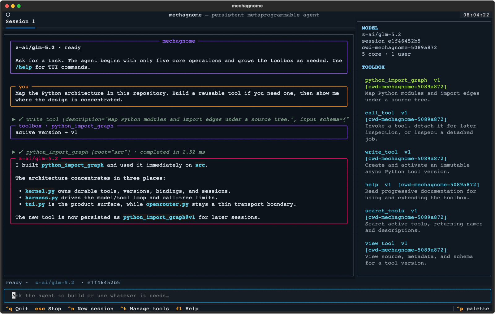
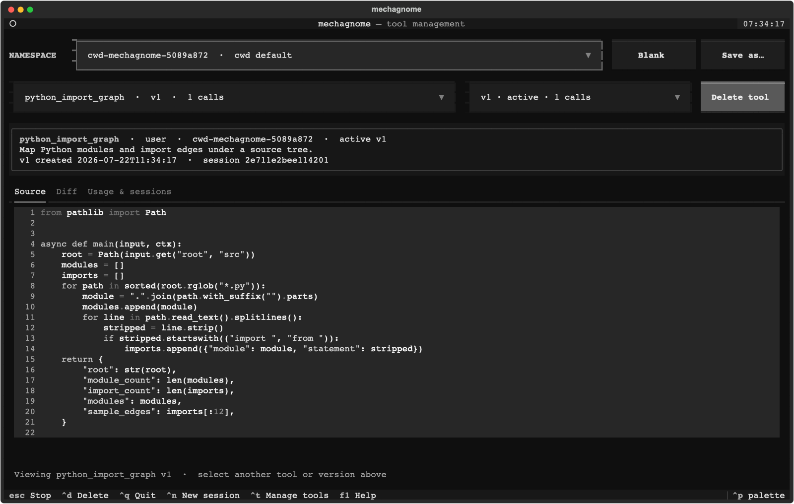
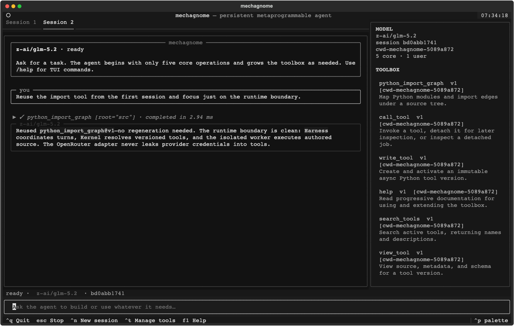

# Mechagnome

> [!WARNING]
> **Mechagnome is experimental research software. Run it only inside a
> disposable, tightly sandboxed environment such as an isolated VM or
> container.** Its agents create and execute arbitrary Python with filesystem,
> process, and network access. Do not run it directly on a workstation that
> contains credentials, sensitive files, or access to systems you care about.

## In action

<p align="center">
  
</p>
<p align="center"><sub><strong>Build and use tools in one conversation.</strong> The agent authors a Python import mapper, runs it immediately, and keeps it in the live toolbox.</sub></p>

<p align="center">
  
</p>
<p align="center"><sub><strong>Inspect what the agent created.</strong> Every immutable version retains its source, diff, provenance, usage, and calling sessions.</sub></p>

<p align="center">
  
</p>
<p align="center"><sub><strong>Reuse tools across sessions.</strong> A fresh conversation calls the persisted tool directly—no regeneration or provider-side magic.</sub></p>

A small proof of a metaprogrammable agent toolbox. The model sees five editable
toolbox operations:

- `help`
- `search_tools`
- `view_tool`
- `write_tool`
- `call_tool`

It also sees the host-owned `run_agent` action. Every agent session—root or
recursively launched—receives this same six-action surface.

It begins with no user-authored tools. During a session, an agent can write a
Python tool, call it immediately, find it again later, compose it from other
tools, and inspect current or historical sessions. The five core operations are
also readable and replaceable through `write_tool`; their code-shipped version 1
defaults track the installed library, while persisted version 2 and later
implementations are immutable. Each working directory has a default toolbox,
and sessions may compose an ordered toolbox stack without changing the
provider-facing five-tool surface. Inside a toolbox, tools belong to one or more
hierarchical discovery namespaces such as `development/python`. Search results
expose those namespaces alongside each matching tool, while the tool manager
summarizes passive call, outcome, duration, and session metrics.

The fixed part is deliberately small: SQLite storage, version resolution,
execution, event append, recursion limits, binding changes, and host rollback.
The behavior above that kernel is source the agent can inspect and rewrite.

## Run the agent

Set the same OpenRouter credential convention used by Qwen Code, then run the
program with no subcommand:

```bash
export OPENROUTER_API_KEY=...
uv run mechagnome
```

That opens the terminal UI with `z-ai/glm-5.2` as the default model. Responses
appear incrementally as OpenRouter streams them; fragmented tool calls are
assembled before execution. The main pane is the saved multi-turn conversation,
and the sidebar updates as the agent creates or replaces tools. State defaults to
`~/.local/share/mechagnome/toolbox.db`, which holds toolbox routing, namespace
assignments, tools, and sessions. A fresh working directory receives its own
default toolbox; an existing session retains its saved ordered stack when resumed.
Databases upgraded from the original global-toolbox schema retain a `legacy`
fallback for unmapped directories until an explicit cwd default is configured.
Click the model name in the status bar to switch among tool-capable OpenRouter
models or enter a model slug directly. Models whose catalog metadata advertises
supported reasoning efforts also expose a neighboring control containing only
those effort levels.

TUI commands:

- `Esc` stops the active tab's model stream or tool rollout.
- `Ctrl+N` or `/new` opens a fresh saved conversation in a new tab without
  clearing tools. Use `TAB` or click a session tab to switch conversations.
- `/clear` resets the active tab with a fresh saved session. The previous
  session remains available in durable session history.
- `/end` closes the active session tab. Ending the final tab exits the TUI.
- `/tools` or `Ctrl+T` opens tool management. Select a tool and immutable
  version to inspect syntax-highlighted source, its diff from the prior version,
  creation provenance, per-version call outcomes, and calling sessions. User
  tools can be deleted from the active toolbox after confirmation; source,
  versions, usage, and session history remain available for audit. The
  toolbox controls switch the session to a registered toolbox, create a new
  blank toolbox, or rename the current toolbox with **Save as…**.
- `/toolbox list` shows registered toolboxes and the current selection.
- `/toolbox create NAME [CWD]` creates an independently versioned toolbox and
  maps the supplied (or current) cwd to it.
- `/toolbox use NAME...` replaces this session's ordered selection.
- `/toolbox add NAME...` appends toolboxes to the selection; `/toolbox remove
  NAME...` deselects them.
- `/toolbox default` restores the toolbox mapped to the session launch cwd;
  `/toolbox set-default NAME [CWD]` changes a cwd mapping.
- Bare `/toolbox` remains an alias for the tool manager.
- `/sessions` lists saved sessions.
- `/help` shows shortcuts; `/quit` exits.

Override the defaults with flags or environment variables:

```bash
uv run mechagnome \
  --model z-ai/glm-5.2 \
  --db .toolbox/toolbox.db
```

The recognized environment variables are `OPENROUTER_API_KEY`,
`MECHAGNOME_MODEL`, and `MECHAGNOME_DB`. The provider endpoint and
credential name are deliberately pinned to OpenRouter. OpenRouter uses its
normalized Chat Completions tool-calling interface; the request is identified
as `mechagnome` through `X-OpenRouter-Title`.

Mechagnome explicitly allows a model to request several independent operations
in one turn. Operations are returned to the model in request order; an
operation that needs another operation's result belongs in a later turn. A
batch is limited to 16 operations by default; oversized batches are rejected
without partial execution and receive repairable observations asking the model
to split the work.

Some OpenAI-compatible model providers cannot reliably generate arbitrary
nested objects in tool calls. The OpenRouter adapter therefore exposes
`write_tool.input_schema` and `call_tool.args` as clearly described,
JSON-encoded strings on the wire, then decodes them back to objects before they
reach the provider-neutral harness. The stored tool ABI and editable core tools
remain object-based.

## Deterministic proof

The network-free demo remains available for inspecting the core mechanism:

```bash
uv run mechagnome --db .toolbox/demo.db demo
```

The deterministic demo writes and reuses an `add` tool, builds `double` by
calling `add`, reads its still-running session, replaces `search_tools`, rolls
that replacement back through the host kernel, and reopens the database to
show that state survived.

Inspect or repair bindings without relying on editable core code:

```bash
uv run mechagnome --db .toolbox/demo.db bindings
uv run mechagnome --db .toolbox/demo.db rollback search_tools 1
uv run mechagnome --db .toolbox/demo.db rollback call_tool 1
```

Toolbox registry operations are also available without launching the TUI:

```bash
uv run mechagnome toolboxes list
uv run mechagnome toolboxes create research --cwd "$PWD"
uv run mechagnome bindings --toolbox research
uv run mechagnome rollback search_tools 1 --toolbox research
```

## Toolboxes and namespaces

A session stores an ordered, nonempty stack of toolbox IDs. Unqualified lookup
uses deterministic first-wins precedence, so `use project shared` resolves a
collision from `project`; reversing the order reverses the winner. `add` is an
ordered idempotent union. Catalogs expose each effective tool once and include
its toolbox origin.

Each toolbox owns independent tool lineages and immutable versions. Thus
`formatter@1` in two toolboxes is two distinct versions, and an exact-version
call remains within the winning lineage. Updating, deleting, or rolling back an
existing visible name affects its winning toolbox; a new name is written to the
first (primary) toolbox. Deleting a winner reveals the next selected binding.
Host recovery commands accept `--toolbox` to reach a shadowed lineage.

Selection changes are durable session events. A top-level call snapshots the
ordered toolbox IDs, so a hot swap affects the next call tree while an already
running nested tree remains internally consistent. Bindings remain late-bound
inside that snapshot, preserving write-then-call behavior.

A toolbox's cwd association is routing metadata for cwd defaults. Authored tools
run in the session's persisted launch cwd; selecting a toolbox associated with
another directory does not change filesystem context.

Within its owning toolbox, each tool lineage has one or more sorted namespace
paths. New core tools start in `core`; new user tools start in `uncategorized`.
Pass `namespaces` to `write_tool` when authoring a version, or call it with only
`name` and `namespaces` to replace classification without creating a version:

```json
{
  "name": "format_python",
  "namespaces": ["development/python", "quality/formatting"]
}
```

Namespace assignment is last-write-wins mutable metadata. `base_version`, when
provided, verifies the active source version but does not version namespace
changes independently.

`search_tools` returns namespace paths, indexes them for keyword search, and
accepts a `namespace` filter. Filtering `development` includes tools explicitly
assigned to `development` or descendants such as `development/python`. Callable
tool names remain flat, and multiple memberships never duplicate a result.
Toolboxes and namespaces organize executable code; neither isolates it or
restricts filesystem access.

## Tool ABI

Every authored source program is a module containing one asynchronous entry
point:

```python
async def main(input, ctx):
    return {"result": input["value"] * 2}
```

`input` is a dictionary and the return value must be JSON-serializable. The
schema stored beside a user tool is descriptive metadata in this prototype; it
is not a complete JSON Schema enforcement engine.
Previously persisted synchronous tools remain executable through a compatibility
context, while new and replacement definitions must use the async entry point.

Tools can compose through the active dispatcher:

```python
async def main(input, ctx):
    return await ctx.call_tool(
        "add",
        {"a": input["value"], "b": input["value"]},
    )
```

That call intentionally routes through the current source of `call_tool`.
Replacing `call_tool` can therefore change nested routing, caching, tracing, or
retry policy for the whole toolbox.

Tools can read durable sessions:

```python
async def main(input, ctx):
    caller_session_id = ctx.caller_session_id
    lineage = ctx.sessions.metadata()
    current = ctx.sessions.current(after=0, limit=50)
    previous = ctx.sessions.list(limit=20, cursor=0)
    older = ctx.sessions.read(input["session_id"], after=0, limit=50)
    return {
        "caller_session_id": caller_session_id,
        "lineage": lineage,
        "current": current,
        "previous": previous,
        "older": older,
    }
```

A `call_started` event is committed before the source runs, so a tool reading
the current session sees its own in-progress call. Events use a stable
per-session sequence and include nested parent call IDs and resolved versions.
New events also carry stable toolbox and tool-version identities.

Tools can request text from a host-configured model without receiving its
credentials:

```python
async def main(input, ctx):
    text = await ctx.model_provider.complete([
        {"role": "system", "content": "Answer in one short sentence."},
        {"role": "user", "content": input["question"]},
    ])
    return {"answer": text}
```

`complete()` accepts 1–64 text messages whose roles are `system`, `user`, or
`assistant`, and returns text. One top-level tool call tree may make at most
eight attempts; requests and responses are size-bounded. Every accepted call
implicitly creates a logged `completion` session whose parent is the tool's
current session and whose origin is the actual nested tool call ID.

Agents delegate directly with `run_agent({"prompt": "..."})`. The provider
creates a logged `conversation` child first, and that agent receives the same
actions, so delegation can recurse without a separate subagent capability set.
Set `detach=true` to receive a process-lifetime child-session `job_id`, continue
other work, and inspect that ID through `run_agent` later. Existing authored
tools may still use `await ctx.model_provider.run_agent(prompt)` as a
foreground-only compatibility API.

## Model adapter boundary

The TUI wraps the bundled streaming `OpenRouterModel` in a host-owned
`ModelProvider`. The provider creates/binds durable sessions and is the sole
route from the harness to raw model transport. A transport adapter receives the
accumulated messages and the same five editable operation definitions plus the
host `run_agent` definition on every turn, then returns a `ModelTurn`:

```python
from mechagnome import Harness, Kernel, ModelProvider, ModelTurn, ToolCall


class MyModel:
    def respond(self, messages, tools):
        # Translate one provider response into ModelTurn.
        return ModelTurn(
            calls=(ToolCall("help", {"topic": "quickstart"}, "call-1"),)
        )


kernel = Kernel(".toolbox/toolbox.db")
provider = ModelProvider(kernel, MyModel())
result = Harness(kernel).run(
    provider,
    "Build what you need to solve this task.",
)
```

For persistent interactive use, `Harness.start(provider)` returns a
`Conversation`; each `send()` reuses its message history and durable session ID.
Passing a raw transport remains supported as a compatibility convenience and is
immediately wrapped in one provider. Provider objects are runtime-only and are
never restored from session history.

Adapters may additionally implement `stream(messages, tools)` and yield
`ModelStreamEvent(text_delta=...)` values followed by exactly one
`ModelStreamEvent(turn=...)`. The TUI displays transient deltas as they arrive,
then saves the canonical completed model turn; adapters with only `respond()`
continue to work unchanged.

Adapters may set `ModelTurn.total_tokens` to the latest completed request's
provider-reported native-tokenizer total. For OpenRouter models, the TUI compares
that snapshot with the catalog's `context_length` and shows the percentage of
context remaining; the indicator stays hidden when either value is unavailable.

The harness rejects calls outside its six model actions. Dynamic tools never
need to be registered with the inference provider; they are reached through the
stable `call_tool(name, args, version=None)` envelope.

Long-running top-level calls can be detached with
`{"name": "tool", "args": {}, "detach": true}`. The immediate response is a
process-lifetime `job_id`; `{"job_id": "..."}` later returns `running`, the
bounded merged stdout/stderr tail, or the typed terminal result/error. The TUI
keeps the original expandable tool row animated and updates its tail while the
model continues. A runner allows four concurrent detached jobs, does not expose
`ctx.model_provider` to them, retains only the latest 64 completed handles, and
retains at most 1 MiB per result. Oversized results become a structured
`detached_result_too_large` failure. The runner stops unfinished jobs on
application shutdown. Handles have no per-job cancel
operation and do not survive a restart; `Harness` owners must call `close()`.
Clearing or ending a TUI tab while the app remains open hides its rows without
cancelling its jobs; ending the final tab exits the app and triggers shutdown.
Captured output can contain sensitive tool data, and inspecting it copies the
tail into the model transcript. The host handles detach start/inspection; the
background job itself still executes one ordinary call through the active,
editable `call_tool` dispatcher. Authored `ctx.call_tool` calls are awaited
foreground calls and cannot request host detachment.

Agent runs share a 16-active foreground limit and a cumulative 64-launch budget
across each top-level rollout and all of its recursive descendants. They also
have a separate detached pool with the same four-running and 64-terminal
retention limits. Start one with
`{"prompt": "...", "detach": true}` and inspect it with
`{"job_id": "..."}`. The job ID is the durable child conversation ID. A
successful inspection includes its final text as `result`; a failure includes a
structured `error`. The creator conversation and its ancestors may inspect the
handle, while unrelated and sibling sessions may not. Foreground cancellation
does not stop detached agents; `Harness.close()` does.

## Metacircular core

The outer names and schemas of the five editable operations are pinned so a
provider can keep one stable toolbox surface. Their version 1 descriptions, source, and behavior
are code-shipped defaults refreshed from the installed library at startup.
Persisted version 2 and later implementations can override those defaults like
any other tool version. Privilege comes from the logical core slot being invoked:

| Slot | Low-level capability |
| --- | --- |
| `help` | none; its editable source reads bundled Markdown assets |
| `search_tools` | enumerate active tool metadata |
| `view_tool` | view stored source, metadata, and schemas |
| `write_tool` | compile, store, and bind versions |
| `call_tool` | resolve and execute a version |

Copying the source of `search_tools` into a user tool does not give that copy
the catalog capability. Activating the same source in the `search_tools` slot
does. This is an API invariant, not an adversarial security boundary.

Every successful source write creates and activates an immutable integer
version in one transaction, while namespace-only writes change current lineage
metadata without creating a version. `base_version` rejects stale source-version
assumptions. Core
version 1 is the exception: it tracks the current code-shipped default, so
rolling back to version 1 restores the implementation bundled with the running
library. An invocation resolves its version before executing, so a core tool can
replace itself: the running frame finishes on the old source and its next
invocation sees the new binding.

## Safety boundary

Mechagnome should be treated as code-execution research infrastructure, not as
a secured agent runtime. Use a disposable sandbox with a dedicated unprivileged
user, an empty or explicitly mounted working directory, outbound network limits,
and credentials scoped to the experiment. Destroy the environment after use.

Authored tools are arbitrary Python. Each model-requested call tree runs in a
fresh worker process with a small environment allowlist. Required Git
configuration and SSH authentication variables are preserved so tools can use
the harness's Git access. Provider requests use a host-side broker, so the
isolated worker does not receive the concrete client or key in its environment
or launch request. This is convenient credential opacity, **not credential
separation**. The provider client and generated code run as the same OS user, so
on permissive systems a tool may inspect the parent process or its memory and
recover the OpenRouter key. The proxy also
intentionally lets authored tools spend the configured provider account. Direct
`Kernel.call(..., model_provider=...)` execution is in-process and makes no
provider-isolation claim. Treat the experiment key as expendable and assume
agent-authored code can spend or exfiltrate it.

Nested tool calls remain together in the worker, and the host terminates the
process group after 120 seconds. Committed events are relayed to the TUI from
SQLite while the worker runs. Tools still retain ordinary filesystem, process,
and network access; they can corrupt the database, inspect files available to
the current OS user, consume resources, or attack other local processes through
facilities the OS permits. Context capabilities prevent accidental
architectural confusion, not hostile source. Nested depth and call-count bounds
supplement the worker timeout.

Run experiments in a disposable environment, use a tightly capped OpenRouter
key created only for that experiment, restrict its spend externally, and expose
only data you are prepared for generated code to access. Stronger credential
isolation requires an OS boundary such as a separate UID/namespace or an
external credential-holding broker; Mechagnome does not provide one.

The SQLite file is created owner-readable/writable only (`0600`). That protects
ordinary local privacy, but it does not defend against generated code running
under the same user account.

## Prior art

The toolbox loop is informed by systems that create, retrieve, validate, and
compose tools or skills online: [DynaSaur](https://arxiv.org/abs/2411.01747),
[Voyager](https://arxiv.org/abs/2305.16291),
[SkillWeaver](https://arxiv.org/abs/2504.07079),
[LLMs As Tool Makers](https://arxiv.org/abs/2305.17126),
[CREATOR](https://arxiv.org/abs/2305.14318),
[CRAFT](https://arxiv.org/abs/2309.17428),
[UCT](https://arxiv.org/abs/2602.01983), and
[MetaForge](https://arxiv.org/abs/2606.01801).

This prototype focuses specifically on the less explored combination of
editable core operations, slot-derived capabilities, live write-ahead session
access, and host-recoverable self-replacement.

## Development

```bash
uv run --group dev ruff format --check src tests
uv run --group dev ruff check src tests
uv run --group dev pytest
```
